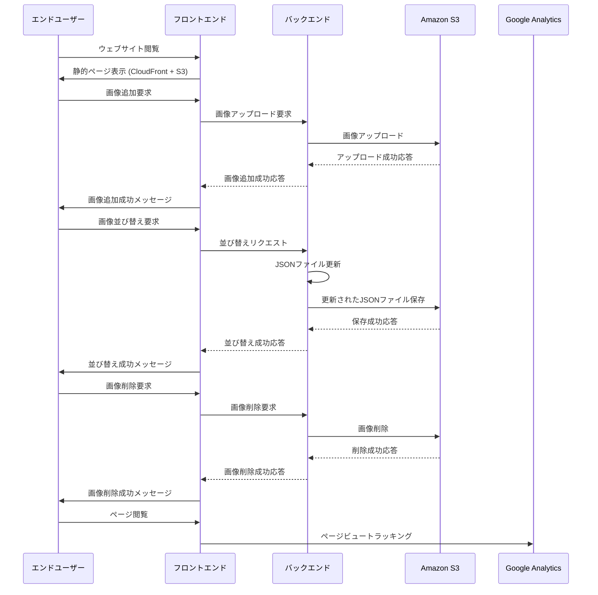

# yuishimamura-frontend

| Structure       |                    |
| --------------- | ------------------ |
| Node            | v18.16.1           |
| Package manager | npm v9.7.2         |
| Build tools     | Vite v1.1.1        |
| Framework       | React + TypeScript |
| CSS             | TailWind + Emotion |

※ Node のパッケージマネージャーは volta を推奨

- [Volta](https://volta.sh/)
- [Vite](https://ja.vitejs.dev/)
- [React](https://ja.react.dev/)
- [TailWind](https://tailwindcss.com/)
- [Emotion](https://emotion.sh/)

## Infrastructure

主に AWS のリソースを使用しています。

- Cloudfront
- S3
- ACM
- Route53

```sh
# terraform plan
make plan-wp

# terraform apply
make apply-wp
```

## Deploy

```sh
# upload to S3
make deploy-s3

# deploy to cloudfront
make deploy-cf
```
## Sequence


